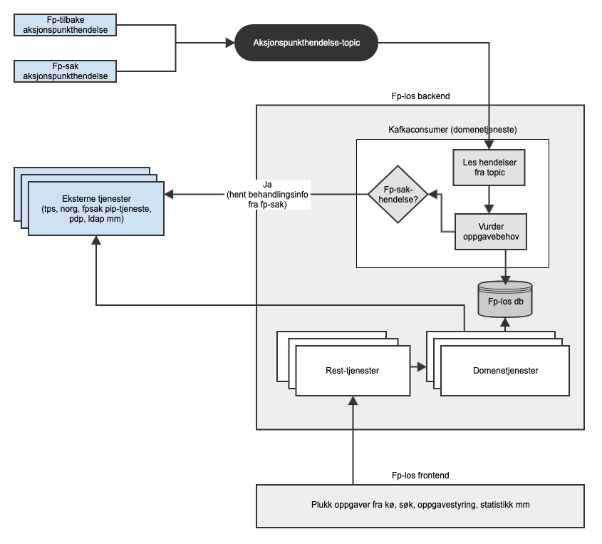

# FPLOS
===============

[](https://github.com/navikt/fplos/actions/workflows/build.yml)
[](https://github.com/navikt/fplos/actions/workflows/promote.yml)
[](https://sonarcloud.io/summary/new_code?id=navikt_fplos)
[](https://sonarcloud.io/summary/new_code?id=navikt_fplos)

[](https://sonarcloud.io/dashboard?id=navikt_fplos)
[](https://sonarcloud.io/dashboard?id=navikt_fplos)
[](https://sonarcloud.io/summary/new_code?id=navikt_fplos)
[](https://sonarcloud.io/summary/new_code?id=navikt_fplos)
[](https://sonarcloud.io/summary/new_code?id=navikt_fplos)
[](https://sonarcloud.io/dashboard?id=navikt_fplos)

FPLOS håndterer oppgave- og ledelsesstyring på foreldrepengeområdet. Fp-sak og fp-tilbake produserer hendelser som representerer tilstand i behandlingsprosessen. FPLOS lytter til hendelsene for å dekke behovet for oppgavestyring og statistikk. 

Oppgavestyrere definerer kriterier som ligger til grunn for køer som fordeler oppgaver etter prioritet til saksbehandlere. 

https://confluence.adeo.no/display/TVF/FP-LOS

## Skisse



## Bygge og kjøre docker lokalt
Greit for å undersøke om containerne fungerer. Har lagt med noen variabler i `docker.list` denne er ikke 100% og bør
trolig settes fra feks `application-local.properties`, men det er nok til å sjekke at basisen fungerer.

```
mvn -B -Dfile.encoding=UTF-8 -DinstallAtEnd=true -DdeployAtEnd=true  -DskipTests clean install

docker build -t fplos .

docker run -d --env-file=docker.list --name fplos fplos
```

## Kjøring lokalt

`no.nav.foreldrepenger.los.web.server.jetty.JettyDevServer` started i Intellij. Lokalt så går den mot Virtuell Tjenesteplattform. Denne må selvsagt kjøre på 
standard porter. Merk du trenger trolig sertifikater om applikasjonen bruker tjenester
på soap. Dette er pga WS-secure, etc.

### Sikkerhet
Det er mulig å kalle tjenesten med bruk av følgende tokens
- Azure CC
- Azure OBO med følgende rettigheter:
    - fpsak-saksbehandler
    - fpsak-veileder
    - fpsak-oppgavestyrer
    - fpsak-drift
- STS (fases ut)
